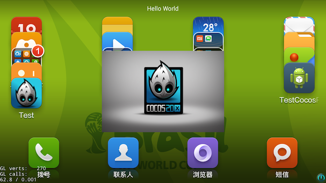
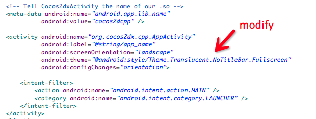
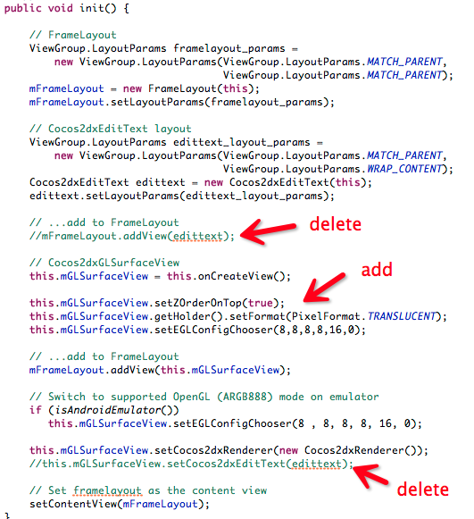
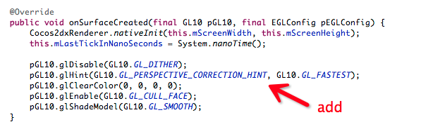

###Cocos2d-x JavaActivity 程序背景透明

---

之前发过一篇[《如何在Cocos2d-x 3.0rc0中让程序背景透明》](http://www.cocoachina.com/bbs/read.php?tid=196780)，但是由于3.0rc0后Cocos2d-x更改为Java Activity，而不再是Native Activity，使得这种方法失效。

这里以最新的Cocos2d-x 3.2 release为例，介绍如何在Cocos2d-x中让程序背景透明。

一样，先上图。

修改的东西不多。主要有3步。

1.在AndroidManifest.xml中设置Activity背景透明

	android:theme="@android:style/Theme.Translucent.NoTitleBar.Fullscreen"

如图，

2.在libcocos2dx项目的org.cocos2dx.lib项目中的Cocos2dxActivity.java文件中，修改init()方法。

增加如下代码：

	this.mGLSurfaceView.setZOrderOnTop(true);
	this.mGLSurfaceView.getHolder().setFormat(PixelFormat.TRANSLUCENT);
	this.mGLSurfaceView.setEGLConfigChooser(8,8,8,8,16,0);
	
删除如下代码（如果不删除的话，顶部会有一个Cocos2dxEditText的白条，Cocos2dxEditText封装了EditText，主要用于TextField，如果程序中有使用到它，那建议更换为EditBox）

	//mFrameLayout.addView(edittext);
	//this.mGLSurfaceView.setCocos2dxEditText(edittext);
	
如图，

        
3.在libcocos2dx项目的org.cocos2dx.lib项目中的Cocos2dxRenderer.java文件中，修改onSurfaceCreated()方法。

增加如下代码：

	pGL10.glDisable(GL10.GL_DITHER);
	pGL10.glHint(GL10.GL_PERSPECTIVE_CORRECTION_HINT, GL10.GL_FASTEST);
	pGL10.glClearColor(0, 0, 0, 0);
	pGL10.glEnable(GL10.GL_CULL_FACE);
	pGL10.glShadeModel(GL10.GL_SMOOTH);
	
如图，

好了，如果有更好的办法欢迎跟帖提出。本工程的[下载地址](https://github.com/fusijie/Cocos2d-x-Transparent)。
